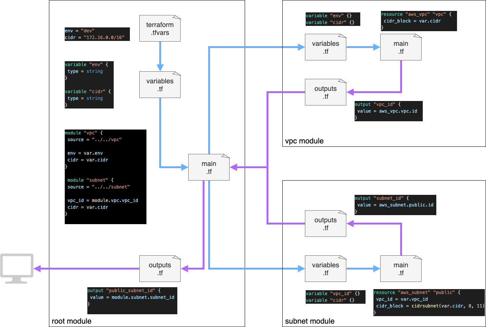

# Terraform練習プロジェクト

## 概要

Terraformの書き方を練習する
構築対象はDockerコンテナ

## 環境

OS: MacOS 12.4
Terraform: v1.1.3
Docker: 20.10.14, build a224086

## 構築図解



## 解説

Dockerの設定(image, network, container)はdocker_configディレクトリに格納
main.tfから各設定を呼び出し構築する

## 実行

### 作成

```bash
$ terraform apply
```

### 削除

```bash
$ terraform destroy
```

